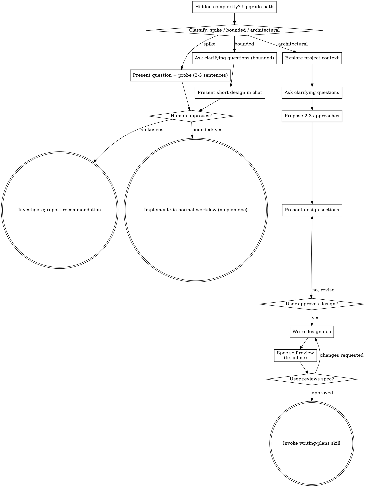

# Codex conversation export

Source: rollout-2026-10-06T16-54-44-01a11336-3f21-7aa1-ad10-a4643199aa4d.jsonl

Exported October 6, 2026 from the available on-disk session. User/assistant text only; system/developer messages, analysis, tool calls/results, and UI context envelopes are excluded. Local paths and recognizable credential tokens are redacted. This is an actual-message export, not a reconstructed conversation. The source may not yet include the latest active turn.

## User — 2026-10-06T21:55:38.023Z

# Files pasted by the user:

## "1. [Assignment](https://github.com/cs409-fa25/mp2#assignment) 2. [Grading Break…": [LOCAL_CODEX_DIR]/attachments/2339dd83-4d38-4e33-8e2a-9637f14ed5b5/Pasted text.txt

## My request:
[https://github.com/cs409-fa25/mp2](https://github.com/cs409-fa25/mp2)

Now help me with this assignment. First prepare a implementation plan

## Assistant — 2026-10-06T21:55:40.628Z

I’ll read the assignment and inspect the starter files, then prepare an implementation plan using the planning skill.

## Assistant — 2026-10-06T21:56:02.553Z

The workspace is empty, and GitHub returned a 404 for the assignment link, so I’m using your pasted instructions as the requirements.

I’m drafting a Pokédex plan pending your API preference. It covers all 100 rubric points and includes an early deployment check: opening or refreshing a detail URL must work on GitHub Pages.

## User — 2026-10-06T21:57:17.004Z

<send_user_message_question_reply>
[{"questionItemId":"[\"request_user_input_async\",\"call_88dfd7eb3670426fbe5f55613212f41b\",0]","question":"Which API/theme would you prefer? I can plan a Pokédex by default because Pokémon naturally supports images, type filters, and sortable attributes.","answer":"can we use multiple"}]
</send_user_message_question_reply>

## Assistant — 2026-10-06T21:57:22.866Z

Yes—the assignment says **“one of the following APIs,”** so the safest approach is **one primary API that fulfills every requirement**. A second API could enrich the details, but I’d confirm with course staff before making multiple APIs central to the project.

Multiple APIs also introduce different data formats, filtering rules, and loading failures. For this assignment, I recommend completing the required features with one first.

Which APIs would you like to combine, and what would each contribute? I’ve saved a [draft implementation plan](<[PROJECT_DIR]/docs/superpowers/plans/2026-10-06-mp2-implementation.md>) around Pokémon and can adapt it to your choice.

## User — 2026-10-06T21:57:23.168Z

let's do themealdb

## Assistant — 2026-10-06T21:57:27.000Z

I’ll revise the plan for TheMealDB and check how its search, categories, and recipe details fit the assignment.

## Assistant — 2026-10-06T21:58:18.743Z

Updated the [implementation plan](<[PROJECT_DIR]/docs/superpowers/plans/2026-10-06-mp2-implementation.md>) for **TheMealDB**.

We’ll build a recipe explorer with:

1. **List:** live name search; sort by name or category in either direction.
2. **Gallery:** food photos with selectable category filters.
3. **Details:** ingredients, measurements, instructions, cuisine, and Previous/Next navigation.
4. **Design:** warm cream background, terracotta accents, responsive layouts.
5. **Deployment:** GitHub Pages, including working direct recipe URLs.

The stack is **React + TypeScript + Vite + React Router + Axios**. TheMealDB permits its free test key for educational use. [API documentation](https://www.themealdb.com/api.php)

The plan covers all 100 rubric points, testing, and submission materials. No application code has been written yet.

## User — 2026-10-06T21:59:25.934Z

Create one gitignored doc to note what we did what all design decisions and all the project context

## Assistant — 2026-10-06T21:59:29.353Z

I’ll create a project context document with our progress, design decisions, assignment requirements, and remaining work, then add it to `.gitignore`.

## Assistant — 2026-10-06T22:00:23.692Z

Created [PROJECT_CONTEXT.md](<[PROJECT_DIR]/PROJECT_CONTEXT.md>) covering completed work, design decisions, requirements, the full plan, and next steps.

Added it to `.gitignore` and verified the rule. It distinguishes confirmed choices from proposals and notes that implementation hasn’t started.

## User — 2026-10-06T22:00:49.034Z

Also one gitignored document to learn all the the tech stack which we used

## Assistant — 2026-10-06T22:00:51.487Z

I’ll add a gitignored learning guide explaining our planned stack, how the pieces fit together, and what to learn for each part of the assignment.

## Assistant — 2026-10-06T22:02:35.952Z

Created [TECH_STACK_GUIDE.md](<[PROJECT_DIR]/TECH_STACK_GUIDE.md>) and verified it’s gitignored.

It covers the planned stack with explanations, examples, exercises, official documentation, and a learning checklist—from React and TypeScript through API calls, testing, and deployment.

## User — 2026-10-06T22:04:44.819Z

Now create detailed tasks and implementation plan so delegate to multi agent system so that they'll work simultaneously on tasks. Also add tests after each chunk/phase for review of the work done. This will be also gitignored. When i do git status in terminal i'm getting it's not a git repo. Add these files to .gitignore so they don't commit in future.

## Assistant — 2026-10-06T22:04:48.020Z

I’ll create a gitignored execution plan with parallel agent assignments, clear file ownership, and test/review gates after each phase. I’ll also initialize Git locally and verify that all planning and learning documents are ignored.

## Assistant — 2026-10-06T22:04:54.008Z

I’m using the parallel-agent planning workflow. The plan will run up to three implementation agents at once, after a shared setup phase fixes the interfaces and test tools. I’ll have a separate agent check the test coverage while I write the task assignments.

## Assistant — 2026-10-06T22:07:13.491Z

The task plan now has file ownership boundaries, shared interfaces, and test/review gates after every phase. The independent review identified a few edge cases to add, including stale recipe responses, retrying failed categories, and detail navigation when filters exclude the current meal.

Git is initialized on `main`. I’m checking that `git status` excludes all four local documents.

## Assistant — 2026-10-06T22:07:39.100Z

Created [MULTI_AGENT_PLAN.md](<[PROJECT_DIR]/MULTI_AGENT_PLAN.md>) with:

- Three simultaneous workers plus a coordinator.
- Detailed tasks, interfaces, dependencies, and exclusive file ownership.
- Tests after every chunk and independent review after each phase.
- Integration, browser, and deployment verification gates.

Initialized Git on `main`. Verified all context, learning, and planning documents are ignored. `git status` now shows only `.gitignore`, which should be committed to preserve those rules.

No application implementation, commits, or pushes have started.

## User — 2026-10-06T22:15:07.120Z

[$superpowers:brainstorming]([LOCAL_CODEX_DIR]/plugins/cache/openai-curated-remote/superpowers/6.4.2/skills/brainstorming/SKILL.md) Explore what addition features we can add also shall we use [$frontend-design](/Users/darshan/.agents/skills/frontend-design/SKILL.md) for better design.
I want the user experience to be good. 

## User — 2026-10-06T22:15:07.128Z

<skill>
<name>frontend-design</name>
<path>/Users/darshan/.agents/skills/frontend-design/SKILL.md</path>
---
name: frontend-design
description: Guidance for distinctive, intentional visual design when building new UI or reshaping an existing one. Helps with aesthetic direction, typography, and making choices that don't read as templated defaults.
license: Complete terms in LICENSE.txt
---

# Frontend Design

Approach this as the design lead at a design studio known for giving every client a distinct visual identity that is not mistaken for anyone else's. This client has already rejected proposals that felt cliché or templated, and is paying for a distinctive point of view: make deliberate, opinionated choices about palette, typography, and layout that are specific to this brief, and take aesthetic risk if justified.

## Ground your designs in the subject matter

If the brief does not identify what the product or subject matter is, identify it yourself before designing, and confirm with the client. You can come up with one concrete subject, the design's audience, and the design's primary job, as a proposal. If there's any information in your memory about the client's preferences or context about what they're building, use that as a hint. The subject's industry, subject matter, materials, and vernacular are where distinctive visual choices come from — a design for a toy for girls aged 8–11 will be very aesthetically different from a dashboard for financial analysts. Build with the brief's real content and subject matter throughout.

## Design principles

For web designs, the hero is the first thing viewers will see. Open with the most characteristic thing in the subject's world, in the form that is most appropriate: a headline, an image, an animation, a live demo, an interactive moment, or other treatments. Be deliberate with your choice: a big number with a small label, supporting stats, and a gradient accent is the default treatment, so only use it if that's truly the best option.

Typography carries the personality of the page. You don't need a different typeface for display or headline text and body content: use one family or two, and if two, make them clearly distinct.

Choose your typefaces deliberately, not the default families you would reach for on any other project, and set a clear type scale following the default guidance of The Elements of Typographic Style with intentional weights, widths, and spacing. When type is used as a headline or visual element, use the type treatment itself as an active part of the design, not a neutral delivery vehicle for the content.

Default to line lengths of less than 80 characters. Serif typefaces can have slightly longer line lengths; give serif body text slightly more line-height than a sans-serif.

Avoid these default typographic treatments; they are the commonest tells of a generated page:
- Accenting just a single word or phrase in a headline, like putting one word in italic/bold or a different color.
- Using all caps for labels.
- Adding unnecessary typographic labels above content.

Visual structure is information. Structural devices like outlines, borders, numbering, eyebrows, dividers, labels, etc., encode useful information about the content rather than decorate it. Many generic designs use numbered markers (01 / 02 / 03), but that's only appropriate if the content actually is a sequence — like a stepped process or a timeline. Before adding numbered markers, check the content really is a sequence.

Use non-user-triggered motion sparingly and deliberately, only to draw attention. A single orchestrated moment — one page-load sequence or one reveal — lands better than scattered effects; fade-and-slide-up entrances on each section and hover transitions on every card are the generic default and read as AI-generated. Motion that answers a person's action (opening, expanding, confirming) is welcome when it shows what changed.

Consider written content carefully. Often a design brief may not contain real content, and it's up to you to come up with copy and placeholder content. Copy can make a design feel as templated as the design itself. See the below section on writing for more guidance.

## Process: plan, review against the brief, build, critique

For calibration, AI-generated design right now clusters around some traits:
1. a warm cream background (near #F4F1EA) with a high-contrast serif display and a terracotta or warm-clay accent (often near #D97757 — Anthropic's own Claude-interaction accent, so on a user's brief it reads as a tell);
2. a near-black background with a single bright acid-green or vermilion accent;
3. a broadsheet-style layout with hairline rules, zero border-radius, and dense newspaper-like columns;
4. the SaaS-card kit: content chopped into identical rounded cards, one border-radius on everything regardless of hierarchy, the same soft grey shadow (rgba(0,0,0,.1)) under each, and gradient washes as decoration;
5. template chrome that appears whatever the subject: a tracked-out ALL-CAPS eyebrow label above every heading; meta strings joined with middle dots ('A · B · C'); labels built as 'WORD — fragment' with a spaced em dash; tinted near-black (#0B0B0B, #111) standing in for black; a monospace face for small data labels; a '→' appended to link and button text.

All traits are legitimate for some briefs, but they are defaults rather than choices, and they appear regardless of subject. Where the brief pins down a visual direction, follow it exactly — the brief's own words always win, including when it asks for one of these looks. Where it leaves an axis free, don't spend that freedom on one of these defaults. As with a hired human designer, there's often a careful balance between doing what you're good at and taking each project as a chance to experiment and learn.

Work in two passes. First, brainstorm a short design plan based on the client's design brief: create a compact token system with color, type, layout, and principles.
- Color: describe the core base palette as 4–6 named hex values.
- Type: the typefaces and their roles.
- Layout: a layout concept, using one-sentence prose descriptions and ASCII wireframes to ideate and compare. Include alignment guidance; should the content be left aligned, center aligned, justified?
- Principles: the high-level guidance for what makes this page unique.

Then review that plan against the brief before building: if any part of it reads like the generic default you would produce for any similar page (work through a similar prompt to see if you arrive somewhere similar) rather than a choice made for this specific brief — revise that part, say what you changed and why. Only after you've confirmed the relative uniqueness of your design plan should you start to write the code, following the revised plan.

When writing the code, be careful of structuring your CSS selector specificities. It's easy to generate CSS classes that cancel each other out (especially with a type-based selector like .section and an element-based selector like .cta). This can happen often with padding/margin between sections.

## Restraint and self-critique

Spend your boldness in one place. Let one element be the memorable thing, keep everything around it quiet and disciplined, and cut any decoration that does not serve the brief. Build to a quality floor without announcing it: responsive down to mobile, visible keyboard focus, reduced motion respected, visually accessible, harmonious color palettes. Critique your own work as you build, taking screenshots to review if your environment supports it — a picture is worth 1000 tokens. Consider Chanel's advice: before leaving the house, take a look in the mirror and remove one accessory. Human creatives have memory and always try to do something new, so if you have a space to quickly jot down notes about what you've tried, it can help you in future passes.

## More on writing in design

Words appear in a design for one reason: to make it easier to understand and use. They are design content, not decoration. Bring the same intentionality and minimalism to copywriting that you would bring to spacing and color. Before writing anything, ask what the design needs to say, and how it can best be said to help the person navigate the experience.

Write from the end user's perspective. Name things by what users will understand in simple language, not by how the system is built. A user manages notifications, not webhook config. Describe what something is or does in plain terms rather than selling it. Being specific and legible to new users is always better than being clever.

Use active voice as default. A CTA says exactly what happens when it is used: "Save changes," not "Submit." An action keeps the same name through the whole flow, so the button that says "Publish" produces a toast that says "Published." The vocabulary of an interface is the signposting for someone navigating the product. Cohesion and consistency are how people learn their way around.

Treat failure and emptiness as moments for direction, not mood. Explain what went wrong and how to fix it, in the interface's voice rather than a person's. Errors don't apologize, and they are never vague about what happened. An empty screen is an invitation to act.

Keep the tone conversational: plain verbs, sentence case, no filler, with tone matched to the brand and the audience. Let each written element do exactly one job.

</skill>

## User — 2026-10-06T22:15:07.130Z

<skill>
<name>superpowers:brainstorming</name>
<path>[LOCAL_CODEX_DIR]/plugins/cache/openai-curated-remote/superpowers/6.4.2/skills/brainstorming/SKILL.md</path>
---
name: brainstorming
description: "You MUST use this before any creative work - creating features, building components, adding functionality, or modifying behavior. Explores user intent, requirements and design before implementation."
---

# Brainstorming Ideas Into Designs

Help turn ideas into fully formed designs and specs through natural collaborative dialogue.

Start by classifying how much process the request needs, then work
through your path: understand the context, refine the idea, present a
design, and get your human partner's approval.

## Establish Shared Understanding

The outcome of brainstorming is an understanding your human partner can
recognize and correct, grounded in what they want to accomplish.

1. **Discover intent.** Use the request and available context to identify
   the intended outcome, who it is for, and what success looks like. When
   that information is missing, ask one focused question about purpose or
   intended use before proposing features or an approach. Knowing the app
   genre does not tell you why your partner wants it. Gathering missing
   requirements does not ask them to authorize the task again.
2. **Write back your understanding.** Summarize the intended outcome,
   relevant constraints, and success criteria in a short note your partner
   can assess. Separate what they said from assumptions. Invite correction
   and incorporate their answer before treating this as the design brief.
3. **Carry intent into the design.** Preserve the agreed understanding in
   the selected path's design artifact: the written spec for architectural
   work, or the in-chat design/probe for bounded work and spikes. Check
   proposed features and technical choices against that understanding.

When the request already supplies the purpose and constraints, reflect
that understanding instead of asking the same questions again. Keep the
note concise; its accuracy and the opportunity to correct it matter.

<HARD-GATE>
Before taking any implementation action, including invoking an
implementation skill, writing product code, scaffolding, installing
product dependencies, or creating an external project, complete the
selected path's prerequisites:

- Spike: the human partner approves the question and probe.
- Bounded: the human partner approves the short in-chat design.
- Architectural: the human partner reviews and approves the written spec,
  then reviews the written implementation plan and selects its execution
  method. Conversational design approval only permits writing the spec;
  written-spec approval only permits invoking writing-plans.

A reply approves the stage actually presented. Approval of an idea or
feature scope does not approve artifacts that do not exist yet. Resume
at the earliest incomplete stage; do not turn one approval into permission
to skip the rest of the selected path. Read-only project exploration is
allowed while those prerequisites remain incomplete.
</HARD-GATE>

## Three Paths

Before your first question, classify the request and say the
classification out loud — "this looks bounded, so I'll present a short
design here rather than write a spec" — so your human partner can
override it:

- **Spike** — a feasibility question ("can we...", "is it possible...",
  "quick and dirty is fine") whose output is an answer, not code you
  keep. Present the question and what you'll try in 2-3 sentences, get
  a nod, then find out as cheaply as correctness allows. No design
  doc, no spec file. Report findings as a recommendation; anything you
  built stays labeled throwaway.
- **Bounded** — a well-scoped change to code that already exists in
  this repo: a new flag, a small endpoint, a one-file fix.
  Understanding the kind of app is not enough — bounded means the flow
  you are changing is already here to read. If there is no existing
  flow to change, the task is not bounded. Ask the clarifying
  questions that matter, present a short design IN CHAT (a few
  sentences to a few short paragraphs), and STOP. Implementation
  starts only after your human partner says yes to that design — a
  bounded task's approval is as hard a gate as an architectural
  one. No spec file, no implementation plan document.
- **Architectural** — new projects, new subsystems, changes that
  restructure how components fit together or alter interfaces others
  depend on. Follow the full process: questions, approaches, sectioned
  design, written spec, then the writing-plans skill.

When in doubt between two paths, take the heavier one. The ratchet is
one-way: hidden complexity discovered mid-task upgrades the path —
stop, say so, and step up. Nothing downgrades mid-task.

## Anti-Pattern: "Too Simple To Need Approval"

Every path ends with your human partner approving the required design
before implementation. A bounded change may need only two sentences in
chat. A new todo-list project is architectural and requires the written
spec and planning handoffs. Scale the artifact to the selected path;
complete that path's reviews before implementation.

## Red Flags

| Thought | Reality |
|---------|---------|
| "This is too simple to need a design" | Follow the selected path: a bounded change gets a short chat design; an architectural change gets the written spec and planning handoffs. |
| "I'll call it bounded and skip the spec" | Reaching for a label to skip work IS the doubt — take the heavier path. |
| "It's bounded and the design is obvious — I'll start while they read it" | The gate is the approval, not the design's length. Present, then stop until you hear yes. |
| "I understand this kind of app, so it's bounded" | Bounded measures the repo, not your familiarity. A new project has no existing flow — it is architectural. |
| "The spike works, so I'll keep the code" | A spike's output is an answer. Keeping the code is a new request — classify it. |
| "It grew, but I'm almost done — no need to re-classify" | Hidden complexity upgrades the path mid-task. Stop and say so. |
| "They approved the spike, so the follow-up change is approved too" | Each task gets its own classification and its own approval. |

## Checklist

Classify first, announce the path, then create a task for each item on
your path and complete them in order.

**Spike:**
1. **Explore project context** — enough to frame the probe
2. **Present question + probe plan** — 2-3 sentences
3. **Get approval** — a nod is enough
4. **Investigate** — as cheaply as correctness allows
5. **Report findings** — a recommendation; label anything built as throwaway

**Bounded:**
1. **Explore project context** — check files, docs, recent commits
2. **Ask clarifying questions** — one at a time, the ones that matter
3. **Present short design in chat** — approach, files touched, testing
4. **Get approval** — STOP and wait for an explicit yes; presenting the design and starting in the same breath is skipping the gate
5. **Implement** — proceed with the normal development workflow (TDD applies); no plan document

**Architectural:**
1. **Explore project context** — check files, docs, recent commits
2. **Offer the visual companion just-in-time** — NOT upfront. The first time a question would genuinely be clearer shown than described, offer it then (its own message); on approval its browser tab opens for you. If no visual question ever arises, never offer it. See the Visual Companion section below.
3. **Ask clarifying questions** — one at a time, understand purpose/constraints/success criteria
4. **Propose 2-3 approaches** — with trade-offs and your recommendation
5. **Present design** — in sections scaled to their complexity, get user approval after each section
6. **Write design doc** — save to `docs/superpowers/specs/YYYY-MM-DD-<topic>-design.md` and commit
7. **Spec self-review** — quick inline check for placeholders, contradictions, ambiguity, scope (see below)
8. **User reviews written spec** — ask user to review the spec file before proceeding
9. **Transition to implementation** — invoke writing-plans skill to create implementation plan

## Process Flow

**Terminal states are path-bound.** Architectural: the ONLY skill you
invoke after brainstorming is writing-plans — never frontend-design,
mcp-builder, or any other implementation skill. Bounded: after
approval, implementation proceeds directly through the normal
development workflow; no plan document. Spike: the terminal state is a
reported recommendation.

## The Process

The subsections below serve the bounded and architectural paths (a
spike stops at "present the probe, get a nod"). Sections from
**Exploring approaches** onward are architectural-path depth — for
bounded work, context plus a few questions plus a short in-chat design
is the whole process.

**Understanding the idea:**

- Check out the current project state first (files, docs, recent commits)
- Before asking detailed questions, assess scope: if the request describes multiple independent subsystems (e.g., "build a platform with chat, file storage, billing, and analytics"), flag this immediately. Don't spend questions refining details of a project that needs to be decomposed first.
- If the project is too large for a single spec, help the user decompose into sub-projects: what are the independent pieces, how do they relate, what order should they be built? Then brainstorm the first sub-project through the normal design flow. Each sub-project gets its own spec → plan → implementation cycle.
- For appropriately-scoped projects, ask questions one at a time to refine the idea
- Prefer multiple choice questions when possible, but open-ended is fine too
- Only one question per message - if a topic needs more exploration, break it into multiple questions
- Focus on understanding: purpose, constraints, success criteria

**Exploring approaches:**

- Propose 2-3 different approaches with trade-offs
- Present options conversationally with your recommendation and reasoning
- Lead with your recommended option and explain why
- YAGNI ruthlessly - remove unnecessary features from every approach and design

**Presenting the design:**

- Once you believe you understand what you're building, present the design
- Scale each section to its complexity: a few sentences if straightforward, up to 200-300 words if nuanced
- Ask after each section whether it looks right so far
- Cover: architecture, components, data flow, error handling, testing
- Be ready to go back and clarify if something doesn't make sense

**Design for isolation and clarity:**

- Break the system into smaller units that each have one clear purpose, communicate through well-defined interfaces, and can be understood and tested independently
- For each unit, you should be able to answer: what does it do, how do you use it, and what does it depend on?
- Can someone understand what a unit does without reading its internals? Can you change the internals without breaking consumers? If not, the boundaries need work.
- Smaller, well-bounded units are also easier for you to work with - you reason better about code you can hold in context at once, and your edits are more reliable when files are focused. When a file grows large, that's often a signal that it's doing too much.

**Working in existing codebases:**

- Explore the current structure before proposing changes. Follow existing patterns.
- Where existing code has problems that affect the work (e.g., a file that's grown too large, unclear boundaries, tangled responsibilities), include targeted improvements as part of the design - the way a good developer improves code they're working in.
- Don't propose unrelated refactoring. Stay focused on what serves the current goal.

## After the Design (architectural path)

**Documentation:**

- Write the validated design (spec) to `docs/superpowers/specs/YYYY-MM-DD-<topic>-design.md`
  - (User preferences for spec location override this default)
- Use elements-of-style:writing-clearly-and-concisely skill if available
- Commit the design document to git

**Spec Self-Review:**
After writing the spec document, look at it with fresh eyes:

1. **Placeholder scan:** Any "TBD", "TODO", incomplete sections, or vague requirements? Fix them.
2. **Internal consistency:** Do any sections contradict each other? Does the architecture match the feature descriptions?
3. **Scope check:** Is this focused enough for a single implementation plan, or does it need decomposition?
4. **Ambiguity check:** Could any requirement be interpreted two different ways? If so, pick one and make it explicit.

Fix any issues inline. No need to re-review — just fix and move on.

**User Review Gate:**
After the spec review loop passes, ask the user to review the written spec before proceeding:

> "Spec written and committed to `<path>`. Please review it and let me know if you want to make any changes before we start writing out the implementation plan."

Wait for the user's response. If they request changes, make them and re-run the spec review loop. Only proceed once the user approves.

**Implementation:**

- Invoke the writing-plans skill to create a detailed implementation plan
- Do NOT invoke any other skill. writing-plans is the next step.

## Visual Companion

A browser-based companion for showing mockups, diagrams, and visual options during brainstorming. Available as a tool — not a mode. Accepting the companion means it's available for questions that benefit from visual treatment; it does NOT mean every question goes through the browser.

**Offering the companion (just-in-time):** Do NOT offer it upfront. Wait until a question would genuinely be clearer shown than told — a real mockup / layout / diagram question, not merely a UI *topic*. The first time that happens, offer it then, as its own message:
> "This next part might be easier if I show you — I can put together mockups, diagrams, and comparisons in a browser tab as we go. It's still new and can be token-intensive. Want me to? I'll open it for you."

**This offer MUST be its own message.** Only the offer — no clarifying question, summary, or other content. Wait for the user's response. If they accept, start the server with `--open` so their browser opens to the first screen automatically. If they decline, continue text-only and don't offer again unless they raise it.

**Per-question decision:** Even after the user accepts, decide FOR EACH QUESTION whether to use the browser or the terminal. The test: **would the user understand this better by seeing it than reading it?**

- **Use the browser** for content that IS visual — mockups, wireframes, layout comparisons, architecture diagrams, side-by-side visual designs
- **Use the terminal** for content that is text — requirements questions, conceptual choices, tradeoff lists, A/B/C/D text options, scope decisions

A question about a UI topic is not automatically a visual question. "What does personality mean in this context?" is a conceptual question — use the terminal. "Which wizard layout works better?" is a visual question — use the browser.

If they agree to the companion, read the detailed guide before proceeding:
`skills/brainstorming/visual-companion.md`

</skill>

## Assistant — 2026-10-06T22:15:10.664Z

I’m using **brainstorming** to explore useful additions and **frontend-design** to shape the visual direction. This is architectural planning because the app hasn’t been built yet. I understand the goal as meeting the rubric while making recipes easy to discover and use; I’ll treat the audience as home cooks unless you steer me otherwise.

## Assistant — 2026-10-06T22:15:23.288Z

Yes—**frontend-design is a good fit**, especially before the agents build separate pages. We should give them one shared visual direction so the app feels consistent.

My understanding: you want a polished recipe app that satisfies the assignment and feels useful beyond the demo. Assuming it’s for home cooks, I see three directions:

| Direction | Useful additions | Trade-off |
|---|---|---|
| **Discover dinner — recommended** | Saved recipes, “Surprise me,” clear filters, restored browsing position | Strong everyday value with modest scope |
| **Cooking companion** | Ingredient checkboxes, distraction-free recipe view, print layout | Better while cooking; more detail-page work |
| **Explore cuisines** | Cuisine browsing, category collections, discovery suggestions | More API/data work and filtering complexity |

I’d start with **Discover dinner**, plus ingredient checkboxes:

- **Save recipes:** bookmark meals on this browser without signing in.
- **Surprise me:** choose a meal from the current filtered results.
- **Ingredient checkboxes:** track what you’ve gathered while keeping measurements visible.
- **Restore your place:** returning from a recipe preserves filters and scroll position.

The biggest UX improvements should be part of the baseline: clear selected filters, useful empty states with “Clear filters,” stable loading layouts, accessible controls, and readable mobile instructions.

For visual design, I’d reconsider our earlier cream-and-terracotta proposal—it was a placeholder. A **modern kitchen notebook** could use porcelain white, aubergine text, herb green, and restrained lemon accents. Food photography would carry the personality, with search immediately visible and ingredients beside instructions on desktop. We can compare concrete layouts once we settle the primary experience.

**Which should be the main experience: discovering dinner, following a recipe while cooking, or exploring cuisines?**

## User — 2026-10-06T22:19:29.881Z

discovering dinner but only add it in scope and our first priority is to satisfy all the requirement of assignment while making it useful beyond the demo. I also liked other two Cooking companion and Explore cuisines so we'll keep that in future scope.  

## Assistant — 2026-10-06T22:19:34.059Z

I’ll update the planning documents to make assignment requirements the first priority, add dinner discovery as the enhancement scope, and keep Cooking companion and Explore cuisines for a future phase.

